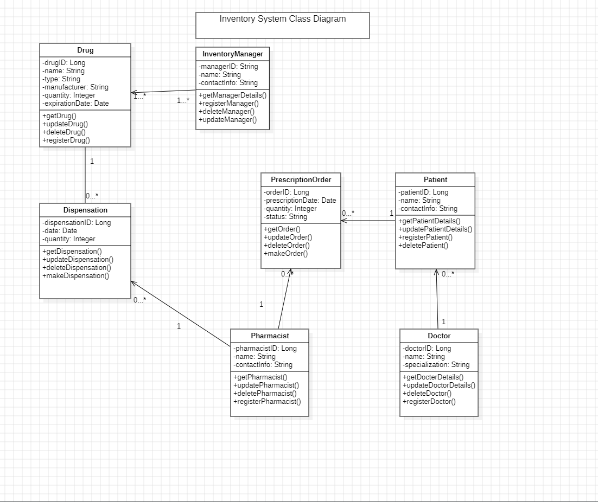

# Inventory System Requirement

# Problem Statement/Description:

Pfizer Health Center (PHC) needs a web-based system to manage its drug inventory. This system will allow an Inventory Manager to add and update drugs in the inventory, tracking each drug’s unique ID, name, type, manufacturer, dosage form (e.g., tablet, liquid), quantity, and expiration date.
Pharmacists can use the system to check drug availability, log dispensed drugs, and request more stock if quantities are low. The system will notify the Inventory Manager to approve these requests and keep records of all stock changes.
Doctors can submit prescription orders so pharmacists can dispense drugs only as prescribed. The system will prevent dispensing expired or out-of-stock drugs. It will also alert the Inventory Manager when drugs are nearing expiration or need reordering based on usage.
The Inventory Manager can generate reports on stock levels, expiring drugs, and restocking history to keep the inventory well-managed.

# Here’s a list of functional requirements based on the problem statement:

1. Drug Registration: The system should allow the Inventory Manager to add new drugs, including ID, name, type, manufacturer, dosage form, quantity, and expiration date.
2. Drug Update: The Inventory Manager should be able to update drug information and quantities in the inventory.
3. Drug Availability Check: Pharmacists should be able to view available drugs and their current stock levels.
4. Dispense Drug: The system should allow Pharmacists to record drugs dispensed based on prescription orders.
5. Prescription Verification: Pharmacists should only dispense drugs with a valid doctor’s prescription.
6. Stock Request: Pharmacists should be able to request additional stock when quantities are low, triggering a notification to the Inventory Manager.
7. Stock Approval: The Inventory Manager should review and approve stock requests submitted by Pharmacists.
8. Out-of-Stock Prevention: The system should prevent the dispensation of drugs that are out of stock or have expired.
9. Expiration Alerts: The system should notify the Inventory Manager when drugs are approaching their expiration date.
10. Reorder Alerts: The system should notify the Inventory Manager when drug quantities fall below a specified threshold.
11. Drug Dispensation History: The system should maintain a record of all drug dispensation actions, including dates, personnel, and quantities.
12. Inventory Report Generation: The Inventory Manager should be able to generate reports on drug availability, upcoming expirations, and restocking history.

# UML Class Diagram
